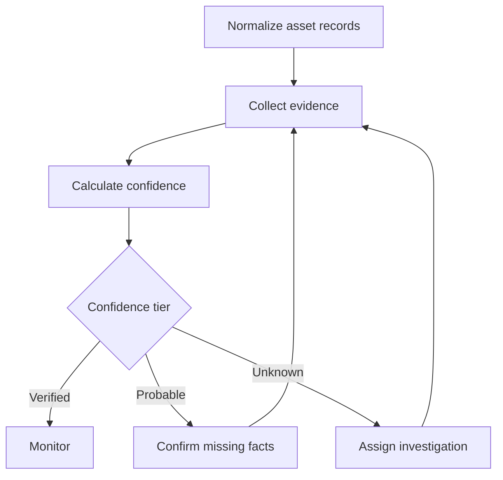

# Asset Assurance Dashboard

[](https://github.com/Natethehobbyguy/asset-assurance-dashboard/actions/workflows/deploy-pages.yml)
[](LICENSE)

An evidence-driven IT asset management portfolio project that answers a practical question:

> How would you identify the assets you know are accounted for, those you are reasonably confident about, and those whose location or custody is unknown?

The dashboard turns that question into a working process. It reconciles observations from multiple sources, calculates explainable confidence and risk scores, and routes uncertain assets into an accountable investigation workflow.

## Live demo

After GitHub Pages is enabled, the app will be available at:

**https://natethehobbyguy.github.io/asset-assurance-dashboard/**

The application is a fictional scenario for **Summit Ridge Co.** All people, assets, and records in the demo are invented.

## The business problem

Asset inventories rarely come from one authoritative system. A CMDB may say a laptop belongs to one employee while endpoint telemetry shows another user, a network scan may locate a server that procurement marked as retired, or a record may have no current technical evidence at all.

This project treats inventory accuracy as a confidence problem:

| Tier | Score | Meaning | Response |
| --- | ---: | --- | --- |
| **Verified** | 80–100 | Current, independent evidence establishes identity, location, and custody | Continue routine monitoring |
| **Probable** | 45–79 | Useful evidence exists, but it is incomplete, stale, or conflicting | Confirm the missing fact |
| **Unknown** | 0–44 | Available evidence cannot establish the asset's present state | Open and assign an investigation |

## Features

- Evidence-based confidence scoring with visible calculation rules
- Multiple evidence sources per asset
- Freshness weighting so old observations lose authority
- Automated risk scoring based on uncertainty and business criticality
- Searchable inventory with confidence, risk, and type filters
- CSV import with upsert behavior and multiple observations per asset
- Inventory and audit-log CSV exports
- Assigned investigation workflow with status, owner, due date, next step, and resolution
- Persistent asset history and audit log
- Inventory health, risk exposure, and evidence-coverage charts
- Responsive interface and browser persistence with `localStorage`
- Automated GitHub Pages deployment

## How the scoring works

Each evidence source has a quality weight:

| Evidence source | Base points |
| --- | ---: |
| Physical audit | 45 |
| Endpoint management | 35 |
| Network discovery | 30 |
| Owner confirmation | 25 |
| Procurement | 15 |
| CMDB | 10 |

Evidence is multiplied by a freshness factor:

- 0–30 days: 100%
- 31–90 days: 70%
- 91–180 days: 40%
- More than 180 days: 15%

Ten points are added when at least two independent sources corroborate the record. Twenty points are subtracted when a known data conflict exists. The final confidence score is capped between 0 and 100.

```text
confidence = Σ(source weight × freshness) + corroboration − conflict
risk       = (100 − confidence) × criticality multiplier ÷ 4
```

Criticality ranges from Low (1) to Critical (4). An active investigation adds a small urgency adjustment. This means a missing critical server is placed ahead of an uncertain low-impact peripheral.

## Workflow



Every update is written to the audit log, so the classification remains explainable and repeatable.

## Architecture

This version intentionally uses a static, dependency-free architecture:

| Layer | Implementation |
| --- | --- |
| Presentation | Semantic HTML and responsive CSS |
| Application logic | Vanilla JavaScript |
| Persistence | Browser `localStorage` |
| Import/export | Client-side CSV parsing and generation |
| Hosting | GitHub Pages through GitHub Actions |

There is no backend and no asset data leaves the browser. This keeps the demo easy to review and host, while the domain model can later be moved behind an API and database.

## Run locally

No packages or build step are required:

```bash
python3 -m http.server 8000
```

Open [http://localhost:8000](http://localhost:8000).

Opening `index.html` directly also works in current browsers.

## Import assets

Use **Asset Inventory → Import CSV**. A template is downloadable inside the app, and [sample-assets.csv](sample-assets.csv) provides a richer example.

Required columns:

```text
id,name,type,serial,owner,location,criticality,evidence_source,evidence_date,evidence_note
```

Repeat an asset ID on multiple rows to attach several evidence observations. Existing IDs are updated; new IDs are created. Valid evidence-source values are `physical`, `endpoint`, `network`, `owner`, `procurement`, and `cmdb`.

## Deploy to GitHub Pages

1. Push these files to the repository's `main` branch.
2. In GitHub, open **Settings → Pages**.
3. Under **Build and deployment**, set **Source** to **GitHub Actions**.
4. Open the **Actions** tab and confirm that **Deploy to GitHub Pages** succeeds.
5. Visit the live-demo URL above. The first deployment can take a few minutes.

Every later push to `main` redeploys the site automatically.

## Suggested interview demo

1. Start on the dashboard and explain the assurance index.
2. Open the critical **Legacy File Server** and show why old CMDB evidence produces a low confidence score.
3. Add a recent network or physical observation and show the score recalculate automatically.
4. Open the investigation queue and assign or resolve the asset.
5. Show the audit log to demonstrate governance and traceability.
6. Import `sample-assets.csv` to demonstrate reconciliation across multiple source observations.

## What this project demonstrates

- Translating an ambiguous business question into measurable rules
- IT asset management and inventory reconciliation
- Data quality, evidence provenance, and auditability
- Risk-based prioritization
- Workflow and user-experience design
- Client-side data import, transformation, persistence, and export
- Static deployment and CI/CD with GitHub Actions

## Roadmap

- Replace browser storage with an API and relational database
- Add authentication and role-based access
- Model asset lifecycle states, cost, warranty, and disposal
- Add duplicate detection and field-level source precedence
- Schedule verification campaigns and escalation notifications
- Integrate mock connectors for MDM, EDR, network, HR, and procurement systems
- Add automated unit and end-to-end test suites

## License

[MIT](LICENSE)
